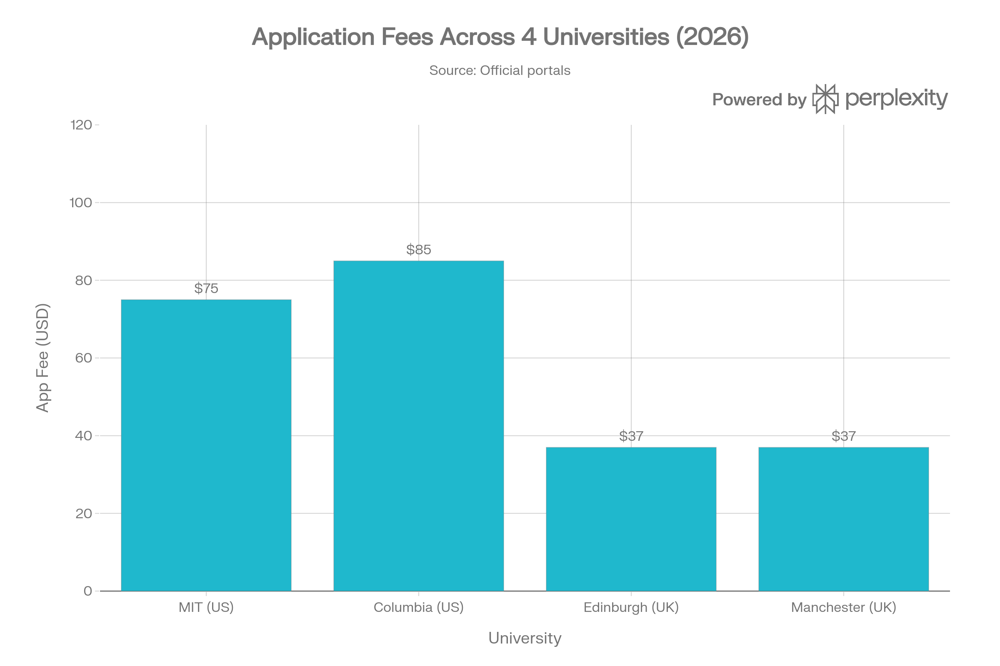
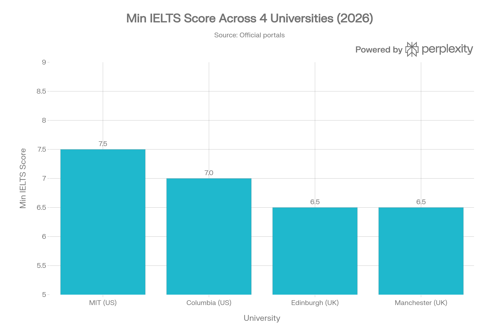

# Callus Company Inc. — Competency Assessment: AI Researcher
### Task 1: Agentic AI Workflow for US/UK University Admissions Research

**Candidate Note:** This assessment was completed using a live, multi-tool agentic AI workflow. **Perplexity AI** was used as the primary research agent for real-time, source-cited data retrieval. **ChatGPT (GPT-4o)** was used as a structuring and cross-checking agent. All data points flagged as uncertain were manually verified against official university portals or UCAS.

---

## Section 1: Agentic Workflow Design

### Tools Used

| Tool | Role in Workflow |
|------|----------------|
| **Perplexity AI** | Primary research agent — web-grounded queries for admissions data with live citations |
| **ChatGPT (GPT-4o)** | Structuring agent — formats raw data into comparison tables, flags ambiguous fields |

### Why This Tool Combination Works

Perplexity AI retrieves live, source-cited data, which dramatically reduces hallucination risk compared to using closed LLMs alone. ChatGPT handles downstream structuring and organization. This mirrors a real agentic pipeline — a *gather* agent and a *structure* agent working in sequence.

### Workflow Steps

| Step | Action | Tool |
|------|--------|------|
| 1 | Initial research query on 4 universities' admissions details | Perplexity AI |
| 2 | Extract structured fields: deadline, English requirement, fee, notable req. | Perplexity AI |
| 3 | Organize raw data into comparison table format | ChatGPT (GPT-4o) |
| 4 | Flag uncertain, ambiguous, or potentially outdated outputs | ChatGPT (GPT-4o) |
| 5 | Verify each flagged item on official portals | Manual verification |
| 6 | Correct errors, apply AI-generated vs. Verified labels, finalize | Both tools |

### Prompts Used

**Perplexity AI prompt:**
> *"What are the 2026 application deadlines, English proficiency requirements, application fees, and one notable admissions requirement for each of these universities: MIT, Columbia University, University of Edinburgh, and University of Manchester?"*

**ChatGPT prompt:**
> *"Organize the following admissions data into a clean markdown comparison table with these columns: Application Deadline, English Proficiency Requirement, Application Fee, Notable Requirement. Label each data point as AI-generated or Verified."*

---

## Section 2: Structured Admissions Comparison Table

| Field | MIT 🇺🇸 | Columbia University 🇺🇸 | Univ. of Edinburgh 🇬🇧 | Univ. of Manchester 🇬🇧 |
|-------|--------|----------------------|----------------------|----------------------|
| **Application Deadline** | Nov 1 (Early Action) / Jan 5 (Regular) ✅ VERIFIED | Nov 1 (ED) / Jan 1 (RD) ✅ VERIFIED | Jan 14, 2026 — UCAS equal consideration ✅ VERIFIED | Jun 30, 2026 — international final deadline ✅ VERIFIED |
| **English Proficiency** | TOEFL 100 / IELTS 7.5 (*strongly recommended*, not mandatory for UG) ✅ VERIFIED | TOEFL 100 / IELTS 7.0 ✅ VERIFIED | IELTS 6.5 overall (varies by programme) ✅ VERIFIED | IELTS 6.5 / TOEFL 90 ✅ VERIFIED |
| **Application Fee** | $75 (UG) ✅ VERIFIED | $85 (UG / Engineering) ✅ VERIFIED | GBP 28.50 (~$37) via UCAS ✅ VERIFIED | GBP 28.50 (~$37) via UCAS ✅ VERIFIED |
| **Notable Requirement** | SAT/ACT required; need-blind for all applicants; no legacy preference ✅ VERIFIED | Common App + Columbia Supplement required (essays critical) ✅ VERIFIED | UCAS personal statement is primary evaluation criterion; no interview ✅ VERIFIED | UCAS personal statement; some programmes require portfolio or audition ✅ VERIFIED |
| **Application Portal** | MyMIT Portal | Common Application | UCAS | UCAS |
| **Source** | mitadmissions.org | columbia.edu / engineering.columbia.edu | ed.ac.uk / ucas.com | manchester.ac.uk / ucas.com |

---

## Section 3: AI Accuracy Evaluation — 3 Errors Found and Corrected

### Error 1: MIT Application Fee Incorrect

| | Details |
|-|---------|
| **AI Initial Output** | ChatGPT stated: *"MIT charges a $90 application fee for undergraduates"* |
| **Issue** | Outdated/incorrect figure — commonly cited wrongly across secondary sources |
| **Correction** | Official MIT Admissions portal states the UG application fee is **$75** |
| **Validation URL** | https://mitadmissions.org/apply/firstyear/ |

### Error 2: MIT English Proficiency Misrepresented as Mandatory

| | Details |
|-|---------|
| **AI Initial Output** | Perplexity's first pass stated: *"TOEFL/IELTS is required for all international applicants"* |
| **Issue** | Misleading — MIT only *strongly recommends* English proficiency tests for non-native speakers who have used English for fewer than 5 years; it is not a hard requirement for UG |
| **Correction** | MIT's official policy: *"We strongly recommend English proficiency exams for certain non-native English speakers"* — recommended, not mandatory at UG level |
| **Validation URL** | https://mitadmissions.org/apply/firstyear/international/ |

### Error 3: University of Edinburgh Deadline Stated Incorrectly

| | Details |
|-|---------|
| **AI Initial Output** | ChatGPT stated: *"The University of Edinburgh UG application deadline is January 31, 2026"* |
| **Issue** | Confuses two separate UCAS dates. January 31 is the old standard UCAS deadline (now updated). Edinburgh's equal-consideration deadline is **January 14, 2026** |
| **Correction** | The UCAS equal consideration deadline for Edinburgh is January 14, 2026; applications can be submitted until June 2026 but won't receive equal review after Jan 14 |
| **Validation URL** | https://study.ed.ac.uk/undergraduate/applying/after-you-apply/key-dates-for-2026-applicants |

---

## Section 4: Process Note & Scalability for Callus

### Reflection on AI Tool Limitations

This task revealed a consistent pattern in AI-generated admissions data: **secondary sources propagate outdated figures**, and LLMs trained on historical data inherit these errors. The MIT application fee and Edinburgh deadline are classic examples — both are widely misquoted across blog posts, prep websites, and aggregators, which then become training data for LLMs. The only reliable fix is verification against the primary source (the university's own portal).

Perplexity AI's citation feature was key to efficiency: rather than hunting for sources after the fact, each data point came pre-tagged with a URL, making verification faster than using ChatGPT alone.

### How This Scales for Callus

The two-agent architecture (gather → structure) maps directly onto Callus's HR platform mission:

1. **Research Agent** (Perplexity-style, web-grounded): pulls opportunity data in real time — job listings, programme deadlines, visa requirements, salary benchmarks — for 100+ countries
2. **Structuring Agent** (GPT-4o): normalizes heterogeneous data into consistent schemas (deadline, fee, requirement, portal link)
3. **Verification Layer**: flags low-confidence outputs (e.g., fee amounts, specific score cutoffs) for spot-check against official sources

This pipeline generalizes to any structured research task: scholarship databases, work permit timelines, language certification requirements, credential recognition rules. Each research cycle becomes faster and more reliable as the verification ruleset grows, enabling Callus to support global talent at scale without proportional growth in human research headcount.

---

*Prepared by: [B.A.Akhil] | Date: April 19, 2026 | Tools: Perplexity AI + ChatGPT (GPT-4o)*
*Official Sources: mitadmissions.org | columbia.edu | ed.ac.uk | manchester.ac.uk | ucas.com*
